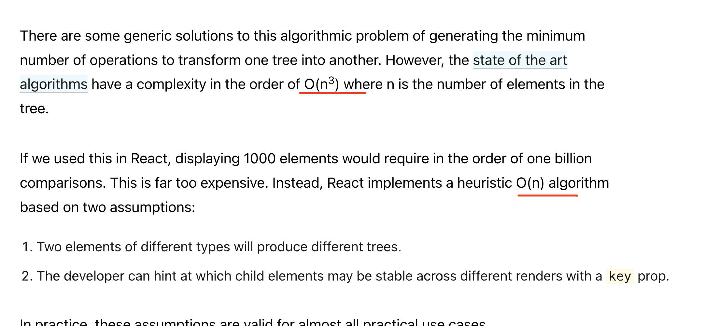

#Fiber

## Andrew: Fiber 是调用栈的重新实现, 专为 React 组件设计. 你可以将一个 fiber 看作一个虚拟的栈帧.

- [译]React 为何要使用链表遍历 Fiber 树： https://github.com/ddzy/react-reading-sources/issues/18；  原文：https://angularindepth.com/posts/1007/the-how-and-why-on-reacts-usage-of-linked-list-in-fiber-to-walk-the-components-tree

- react 为啥要自己实现 requestIdleCallback [https://github.com/facebook/react/issues/13206?source=post_page---------------------------#issuecomment-418923831]
<!-- MAY BE OFFTOPIC:
requestIdleCallback is called only 20 times per second - Chrome on my 6x2 core Linux machine, it's not really useful for UI work.
requestAnimationFrame is called more often, but specific for the task which name suggests.
 -->

- ps: 二叉树的基于栈的深度优先遍历

## reconciliation
- https://www.velotio.com/engineering-blog/react-fiber-algorithm#:~:text=Though%20we%20call%20it%20a,return%20after%20completion%20of%20work.

- 算法复杂度O(n)
- https://legacy.reactjs.org/docs/reconciliation.html

保障O(n) 复杂度的依据是  element  [type] and  [key]
React implements a heuristic O(n) algorithm based on two assumptions:

Two elements of different types will produce different trees.
The developer can hint at which child elements may be stable across different renders with a key prop.

## Initial render

- create Fiber

## render 阶段

- in React 15, the stack reconciler was synchronous.
- Fiber uses requestAnimationFrame for higher priority updates and requestIdleCallback for lower priority updates. So, while scheduling a work, Fiber checks the priority of the current update and the deadline (free time after the end of the frame).

## diff 对比顺序

### 

- reacr15 递归调用 不可中断； react 16 可中断可恢复可暂停的 schedule

- type

- atributes /  props

- Recursing On Children:  children order ->  key

### Begin Step
- workLoop
- beginWork

### Complete Step
- completeUnitOfWork

### commit 阶段
- completeRoot

##  time-slice  

